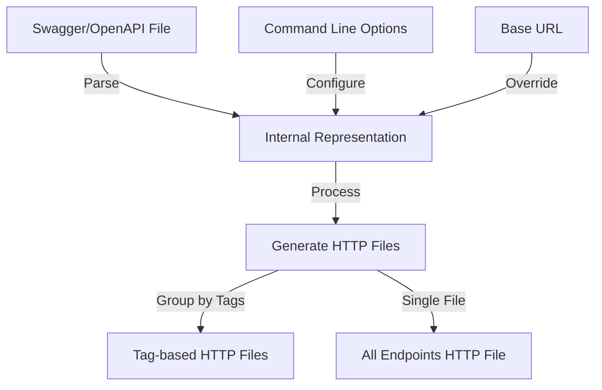
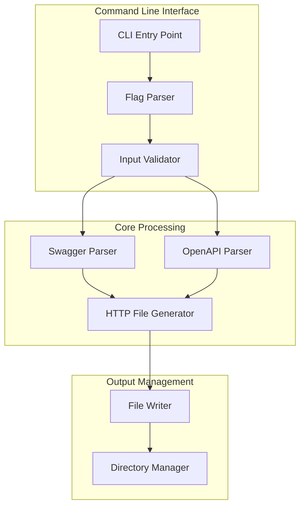
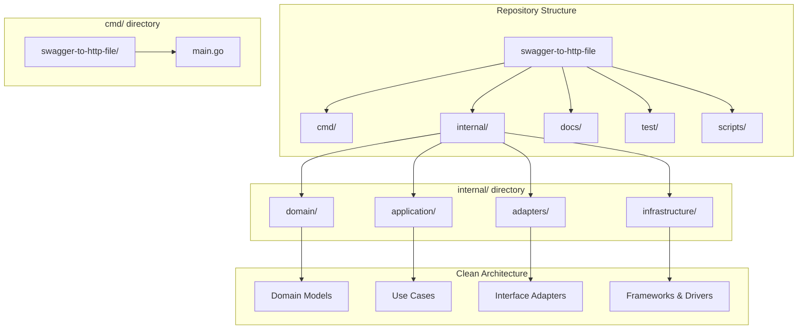
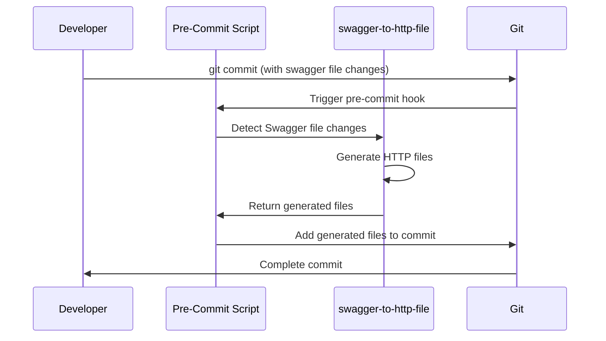
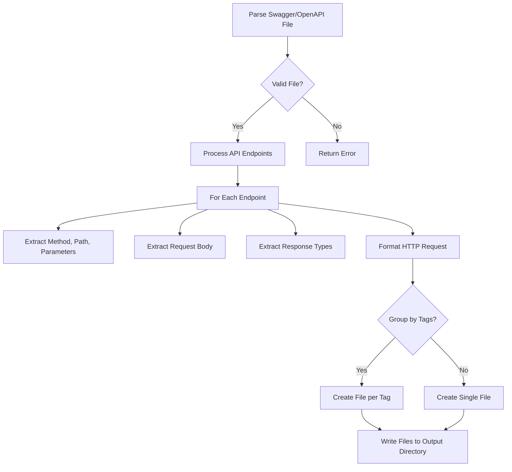
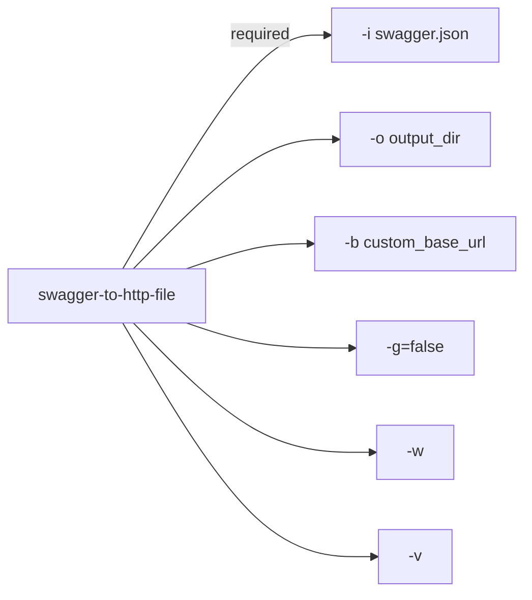
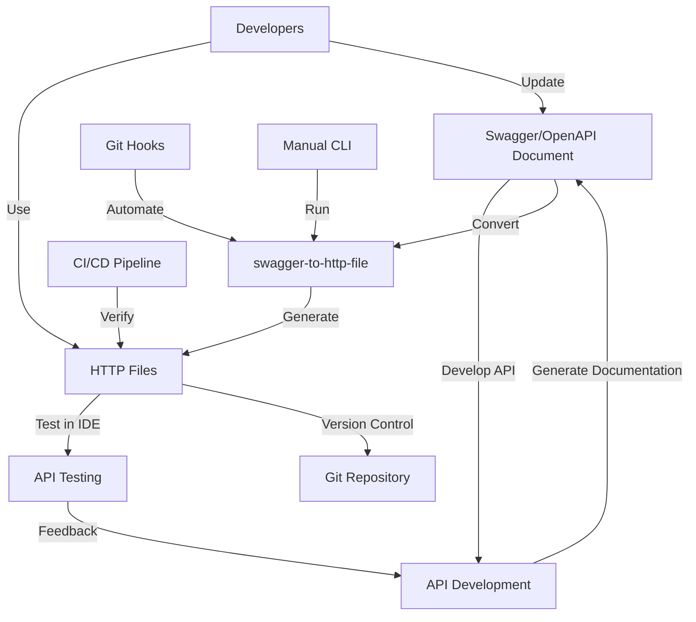

# Diagrams and Visual Guides

This document provides visual representations of the tool's architecture, workflow, and functionality to help users better understand how `swagger-to-http-file` works.

## Conversion Workflow



## Architecture



## Directory Structure



## Git Hooks Integration



## HTTP File Generation Process



## Command Line Usage



## HTTP File Structure

```
# Global variables
@baseUrl = https://api.example.com
@apiKey = your_api_key

### Get Pet by ID
GET {{baseUrl}}/pets/{{petId}}
Accept: application/json

### Create Pet
POST {{baseUrl}}/pets
Content-Type: application/json

{
  "name": "Fluffy",
  "species": "cat",
  "age": 3
}
```

## IDE Integration

### VS Code REST Client

After generating HTTP files, you can use them in VS Code with the REST Client extension:


### JetBrains HTTP Client

Similarly, in JetBrains IDEs, the built-in HTTP client can execute the generated requests:


## Complete Workflow



These diagrams provide a visual understanding of the tool's architecture, workflow, and usage patterns. They can be rendered by opening this markdown file in a viewer that supports Mermaid diagrams, such as GitHub, or using tools like Mermaid Live Editor.
